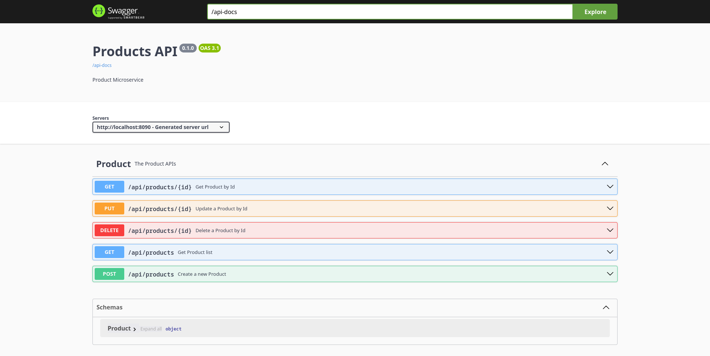

# ms-products



## Create image

```sh
sudo docker build -t ms-products:0.1.0 .
```

## Run container

```sh
sudo docker run -d -p 8090:8080 --name ms-products ms-products:0.1.0
```

## Util Commands

### Images

*Build an image from a Dockerfile*

```sh
sudo docker build -t <image_name>[:<image_version>] [-f Dockerfile] .
```

*List local images*

```sh
sudo docker images
```

*Delete an image*

```sh
sudo docker rm <image_name>
```

*Remove all unused images*

```sh
sudo docker image prune
```

### Containers

*Create and run a container in the background with and publish a container's port to the host from an image, with a custom name*

```sh
sudo docker run -d -p <host_port>:<container_port> --name <container_name> <image_name>[:<image_version>]
```

*List current running containers*

```sh
sudo docker ps
```

*List all containers (running and stopped)*

```sh
sudo docker ps -a
```

*Start, stop, or delete an existing container*

```sh
sudo docker start|stop|rm <container_name> (or <container-id>)
```

### Docker Hub

*Tag an image to publish to Docker Hub*

```sh
sudo docker <image_name> <username>/<image_name>:<image_version>
```

*Publish an image to Docker Hub*

```sh
sudo docker push <username>/<image_name>[:<image_version>]
```

*Pull an image from a Docker Hub*

```sh
sudo docker pull <image_name>
```

## References

[Docker Cheatsheet](https://docs.docker.com/get-started/docker_cheatsheet.pdf)
