# Pasos para realizar el despliegue

## Paso 1: Ingress

0. Verificar que el controller esté funcionando:

```sh
kubectl get pods -n ingress-nginx
```

En caso que el Ingress Controller no se encuentre instalado, continuar con el resto de los pasos, caso contrario continuar con el siguiente pase:  "**Paso 2: Aplicar archivos de despliegue**".

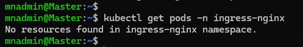

1. Instalar Ingress Controller (NGINX Ingress Controller)

```sh
kubectl apply -f https://raw.githubusercontent.com/kubernetes/ingress-nginx/main/deploy/static/provider/cloud/deploy.yaml
```

2. Verificar que el controller esté funcionando:

```sh
kubectl get pods -n ingress-nginx
```

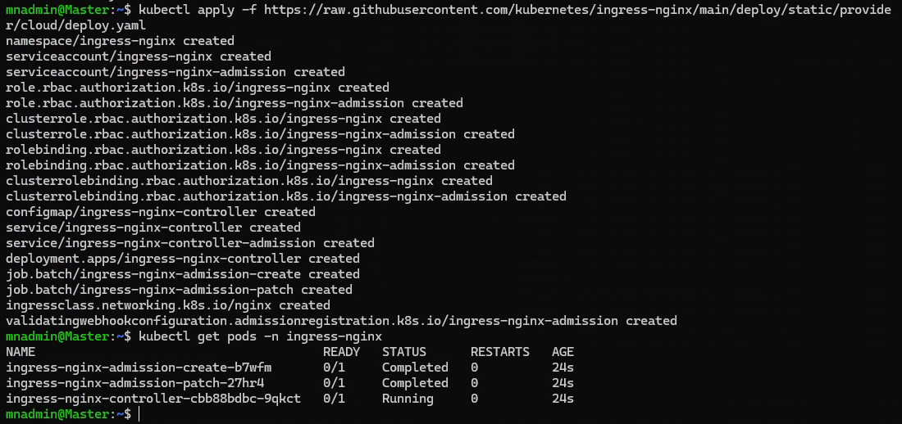

## Paso 2: Aplicar archivos de despliegue

Pasos para aplicar los archivos:

1. Aplica el namespace:

```sh
kubectl apply -f namespace.yaml
```

2. Aplica el Configmap:

```sh
kubectl apply -f configmap.yaml
```

3. Aplica el Deployment:

```sh
kubectl apply -f deployment.yaml
```

4. Aplica el Service:

```sh
kubectl apply -f service.yaml
```

5. Aplica el Ingress:

```sh
kubectl apply -f ingress.yaml
```

6. Verificar elementos aplicados:

```sh
kubectl get all -n products-app-ns
```


Se lista todos los componentes y configuración aplicada de acuerdo a los YAML. p.e.: Según el requerimiento del proyecto, **se observa que se está utilizando 2 réplicas para la alta disponibilidad**.

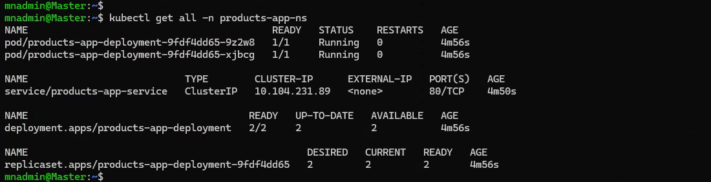

## Pase 3: Probar el enrutamiento

> [!IMPORTANT]
> Debido al requerimiento del proyecto de utilizar base de datos en memoria y al no ser posible referenciar a una base de datos H2 en memoria desde multiples nodos o pods. Se ha optado por actualizar el número de réplicas de 2 (requerimiento del proyecto) a 1 para continuar con las pruebas del enrutamiento y carga de datos a los endpoints del microservicio.

Actualizar el archivo `deployment.yaml` y actualizar el número de replicas a 1, después del cambio la sección de replicas debería quedar similar a lo siguiente:

```sh
spec:
  replicas: 1
```

Archivo `deployment.yaml` antes del cambio.

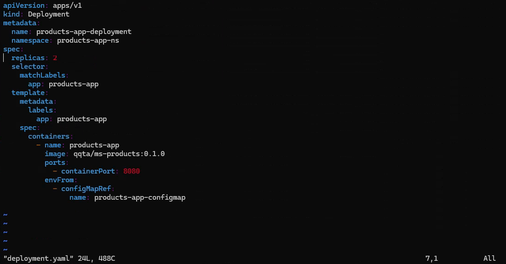

Archivo `deployment.yaml` después del cambio.


Aplicar el cambio del archivo actualizado:

```sh
kubectl apply -f deployment.yaml
```

Verificar el deployment aplicado

```sh
kubectl get deployment -n products-app-ns
```


1. Verificar la IP del Ingress Controller

```sh
kubectl get svc -n ingress-nginx
```

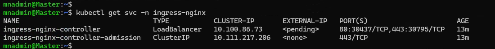

> [!IMPORTANT]
> El estado *pending* en **EXTERNAL-IP** para el servicio `ingress-nginx-controller` significa que el clúster de Kubernetes no ha podido asignar una IP externa al Ingress Controller, esto debido a que no estamos usando un proveedor de nube que soporte automáticamente balanceadores de carga (LoadBalancer), como GKE, EKS o AKS.
> Por este motivo, debemos cambiar el tipo de servicio: de `LoadBalancer` a `NodePort`.

2. Cambiar el tipo de servicio a `NodePort`.

Editar el servicio `ingress-nginx-controller`

```sh
kubectl edit svc ingress-nginx-controller -n ingress-nginx
```

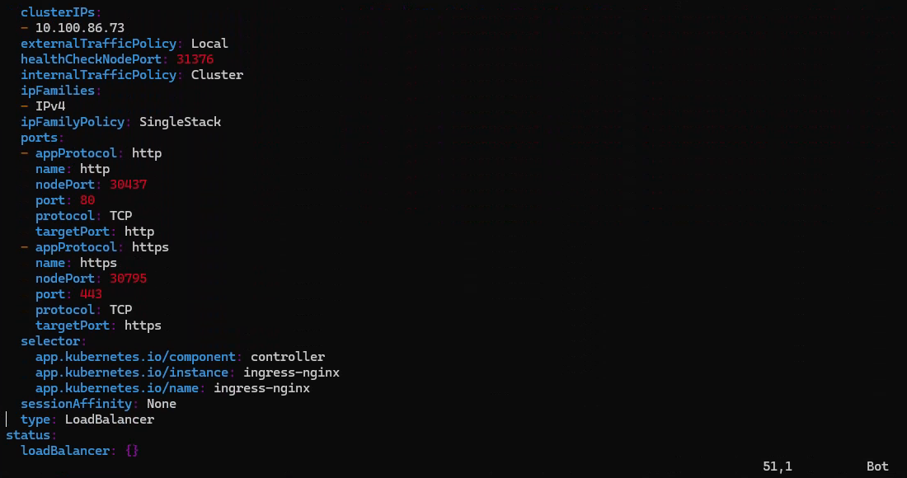

Cambiar `type: LoadBalancer` a `type: NodePort`, y guardar los cambios. Luego del cambio, el archivo debería verse algo así:

```sh
  spec:
    type: NodePort
```

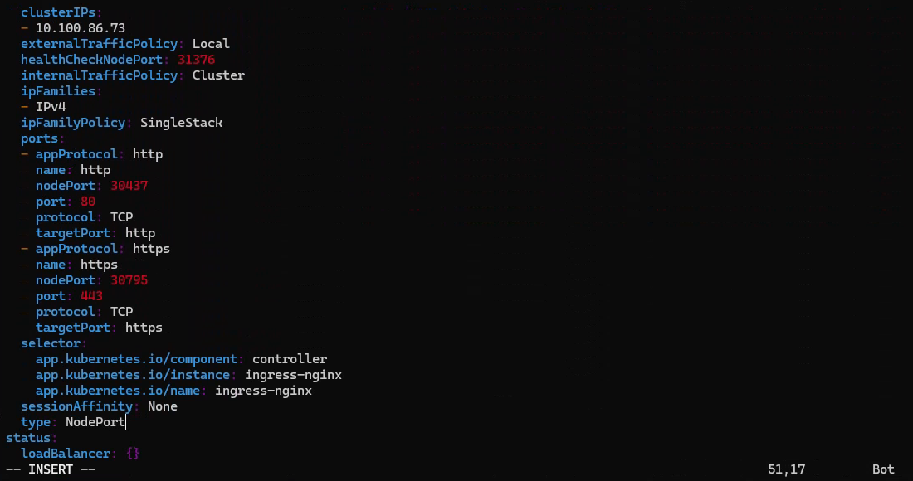


Verificar los cambios realizados

```sh
kubectl get svc -n ingress-nginx
```

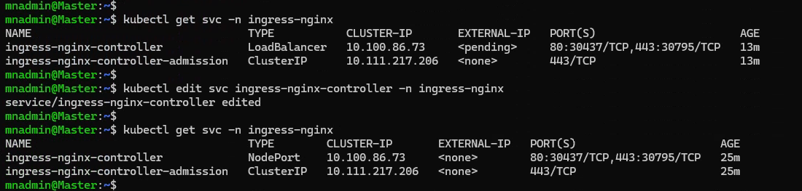

3. Probamos las peticiones CRUD del microservicio

Las pruebas de enrutamiento mediante `curl` muestran que las solicitudes dirigidas a `store.acme.com` reciben las respuestas esperadas desde el servicio correspondiente. Además, la configuración en el archivo /etc/hosts permite la resolución local de nombres de host, facilitando el acceso y verificación del enrutamiento a través del controlador de Ingress expuesto en un puerto específico (NodePort).

**Actualizar el archivo `/etc/hosts` para asociar ip y dominio**

Verificar el IP actual del servicio

```sh
kubectl get svc -n ingress-nginx
```

Actualizar `/etc/hosts` para asociar IP y dominio

```sh
echo "10.100.86.73 store.acme.com" | sudo tee -a /etc/hosts > /dev/null
```

Verificar actualización de `/etc/hosts`

```sh
grep store.acme.com /etc/hosts
```

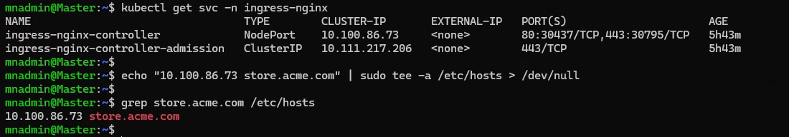


**Rutas expuestas por el microservicio**

```txt
[GET] api/products/{id}
[PUT] api/products/{id}
[DELETE] api/products/{id}
[GET] api/products
[POST] api/products
```

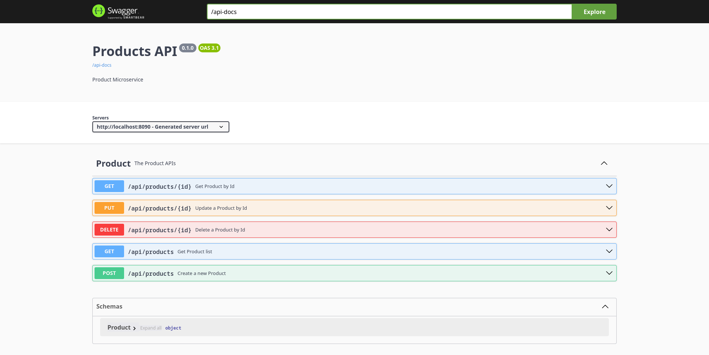

Realizar peticiones al endpoint del microservicio

Reemplazar IP por IP del servicio

```sh
curl -H "Host: store.acme.com" http://IP:80/api/products
```

También se puede probar con dominio asociado a IP en `/etc/hosts`
```sh
curl -H "Host: store.acme.com" http://store.acme.com/api/products
```


*Create*

Se crea dos registros de prueba.

Registro de primer ítem.

```sh
curl -X 'POST' \
  'http://IP:80/api/products' \
  -H 'Host: store.acme.com' \
  -H 'accept: */*' \
  -H 'Content-Type: application/json' \
  -d '{
  "name": "Galletas Morochas",
  "description": "Galletas de Vainilla rellenas de Chocolate",
  "price": 15.50
}'
```

Registro de segundo ítem.

```sh
curl -X 'POST' \
  'http://store.acme.com/api/products' \
  -H 'Host: store.acme.com' \
  -H 'accept: */*' \
  -H 'Content-Type: application/json' \
  -d '{
  "name": "Galletas Vainilla",
  "description": "Tradicionales Galletas con sabor a Vainilla",
  "price": 12
}'
```

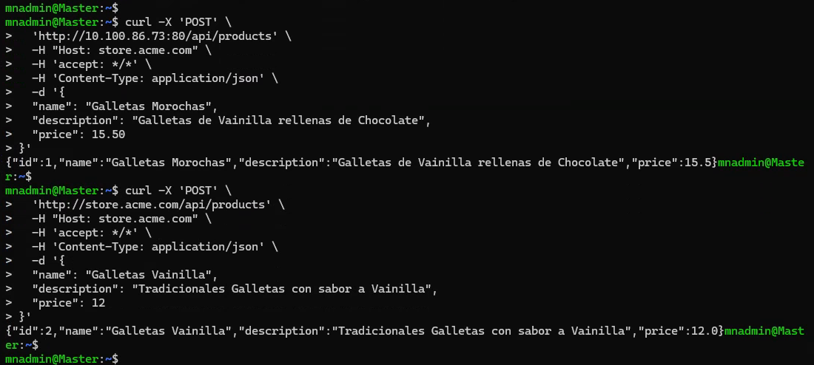

*Read*

```sh
curl -H "Host: store.acme.com" http://IP:80/api/products
```

```sh
curl -H "Host: store.acme.com" http://store.acme.com/api/products
```

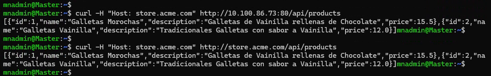

```sh
curl -H "Host: store.acme.com" http://store.acme.com/api/products/1
```

```sh
curl -H "Host: store.acme.com" http://store.acme.com/api/products/2
```

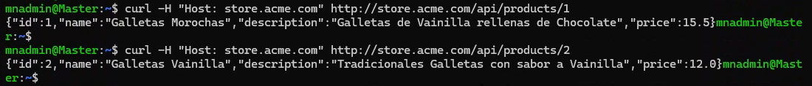

*Update*

Estado actual del recurso

```sh
curl -H "Host: store.acme.com" http://store.acme.com/api/products/2
```

Actualización

```sh
curl -X 'PUT' \
  'http://store.acme.com/api/products/2' \
  -H 'Host: store.acme.com' \
  -H 'accept: */*' \
  -H 'Content-Type: application/json' \
  -d '{
  "name": "Galletas Margaritas",
  "description": "Galletas de Vainilla en forma de Girasol",
  "price": 13
}'
```

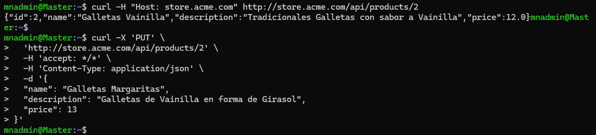

Estado luego del cambio

```sh
curl -H "Host: store.acme.com" http://store.acme.com/api/products/2
```

*Delete*

Antes del eliminar el recurso

```sh
curl -H "Host: store.acme.com" http://store.acme.com/api/products/2
```

Eliminar el recurso

```sh
curl -X 'DELETE' \
  'http://store.acme.com/api/products/2' \
  -H 'Host: store.acme.com' \
  -H 'accept: */*'
```

Después de eliminar el recurso

```sh
curl -H "Host: store.acme.com" http://store.acme.com/api/products/2
```

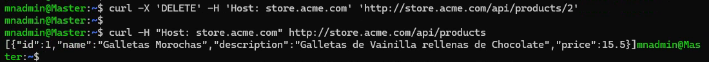

```sh
curl -H "Host: store.acme.com" http://store.acme.com/api/products
```
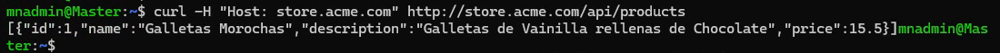
